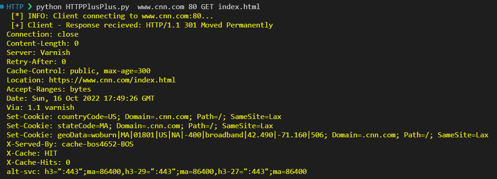
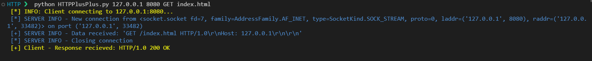
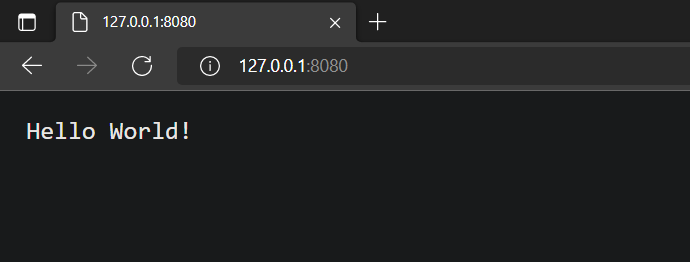
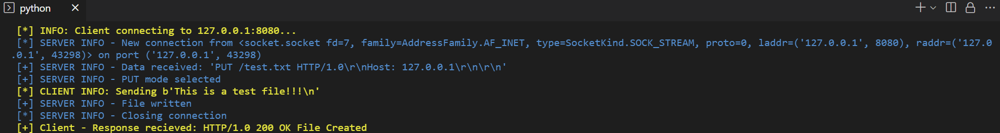

## Project 1: Custom HTTP ## 

### Explanation: How it Works ### 

The server is a simple HTTP server that can handle GET and PUT requests. The client is a simple HTTP client that can handle GET and PUT requests. The server and client are both written in Python. It works as follows:

- point 1
- point 2
- point 3 


## Tests ## 

#### Test 1A: CNN Client Connection Test ####

Connected to CNN with the command  ```python HTTPPlusPlus.py www.cnn.com 80 GET index.html``` and received the following response:

  

#### Test 1B: Connected to internal server ####

Connected to my own internal server with the command ```python HTTPPlusPlus.py localhost 8080 GET index.html``` and received the following response (yellow is client and blue is server output):

  

#### TEST 2A: Connected with browser to server ####

Connected to my internal server with a browser (Microsoft Edge) and received the following response:

  

  

#### TEST 2B: Connected to internal server with GET ####

Connected to my own internal server with the command ```python HTTPPlusPlus.py localhost 8080 GET index.html``` and received the following response (yellow is client and blue is server output):

  


#### TEST 2C: Connected to internal server with PUT ####

Connected to my own internal server with the command ```python HTTPPlusPlus.py localhost 8080 PUT test.txt``` and received the following response (yellow is client and blue is server output):

  


## License ##


**Copyright 2022 Justin Marwad. All rights reserved.**

Permission is hereby granted, free of charge, to any person obtaining a copy of this software and associated documentation files (the "Software"), to deal in the Software without restriction, including without limitation the rights to use, copy, modify, merge, publish, distribute, sublicense, and/or sell copies of the Software, and to permit persons to whom the Software is furnished to do so, subject to the following conditions:

The above copyright notice and this permission notice shall be included in all copies or substantial portions of the Software.

THE SOFTWARE IS PROVIDED "AS IS", WITHOUT WARRANTY OF ANY KIND, EXPRESS OR IMPLIED, INCLUDING BUT NOT LIMITED TO THE WARRANTIES OF MERCHANTABILITY, FITNESS FOR A PARTICULAR PURPOSE AND NONINFRINGEMENT. IN NO EVENT SHALL THE AUTHORS OR COPYRIGHT HOLDERS BE LIABLE FOR ANY CLAIM, DAMAGES OR OTHER LIABILITY, WHETHER IN AN ACTION OF CONTRACT, TORT OR OTHERWISE, ARISING FROM, OUT OF OR IN CONNECTION WITH THE SOFTWARE OR THE USE OR OTHER DEALINGS IN THE SOFTWARE.

